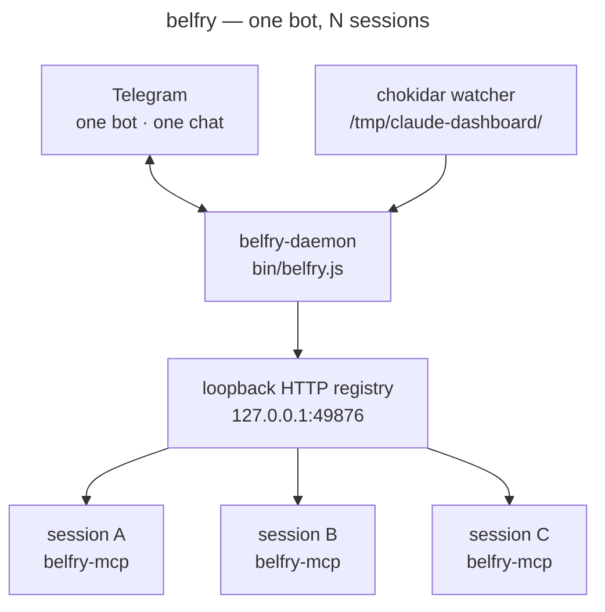

# belfry

Telegram-to-terminal MUX rigging for remote driving of multiple Claude Code projects. Status from N parallel sessions fans out to one Telegram feed; replies on Telegram feed back into the matching session as if you'd typed them at the prompt.

[](https://github.com/harteWired)

Single-user, single-platform (Telegram), single-host (loopback). Read `CLAUDE.md` for the architecture and design constraints.

## What it does

Two flows, one daemon.

**Outbound.** Watches `/tmp/claude-dashboard/<slug>.json` files (a shared local-machine convention; see `docs/CONVENTION.md`). When a subscribed slug enters a state you care about (`ready`, `error`), composes a 3-line message with the last user prompt + last Claude response and pushes it to your Telegram bot. Per-slug throttle and coalesce keep fan-out bursts from spamming you.

**Inbound.** Replies on Telegram route back to the matching session via a per-session `belfry-mcp` MCP plugin. The daemon owns the bot and the registry; each plugin registers over loopback HTTP and long-polls for replies, then emits MCP `notifications/claude/channel` to inject the text into its parent claude as user input — same path the bundled `plugin:telegram` uses, generalized to N sessions sharing one bot. No multiplexer, no keystroke injection — the local terminal stays sovereign.

**Replying to Telegram from the session.** Two paths. The model can call belfry-mcp's `reply` tool to send back explicitly. Or, automatically: when an inbound Telegram message routes into a session, the daemon marks the slug as owing a reply; on the next status flip to `ready` for that slug, it sends `last_response` quote-replied to the originating message and clears the marker.

Routing inbound: quote-reply (primary) or `/<slug-name> message body` or `/<nickname> body` (slug aliases). Anything else falls into the conversational layer — described below. Replies from any chat ID other than `BELFRY_CHAT_ID` are silently dropped.

## Commands

The leading slash is optional on every command — `status` works the same as `/status`. Phone keyboards make the slash a tap-and-hold detour, so belfry accepts both.

| Command | What it does |
|---|---|
| `status` | List every active session, one line each |
| `status <slug>` | Recent activity for one session, Haiku-summarized via the brain (subscription auth) when running |
| `nick <name> <slug>` | Alias a slug to a short name. Names: `[a-z0-9][a-z0-9-]{0,31}` |
| `unnick <name>` | Remove an alias |
| `nicks` | List all aliases |
| `help [topic]` | Reference text. Topics: `routing`, `nicknames`, `status`, `agent` |
| `resume` | List recent Claude Code sessions per slug |
| `resume <slug>` | List recent sessions for one slug |
| `resume <slug> <uuid>` | Get a copyable `claude --resume <uuid>` command, or auto-launch via `BELFRY_RESUME_LAUNCHER` if set |

Slugs always win over nicknames on collision — a session literally named `ob` beats a nickname `ob`. Reserved names (`status`, `nick`, `unnick`, `nicks`, `help`, `resume`) cannot be used as nicknames.

## Inbound attachments

- **Photos** — Telegram photos with a caption that routes (slug-prefix, nickname, or quote-reply) get downloaded (4 MB cap) and forwarded to the receiving session via the channel notification's `image_path` field. Bare photos with no caption and no quote-reply are dropped — caption-or-quote tells belfry where to send it.

The attachment path respects the existing trust boundary — only messages from `BELFRY_CHAT_ID` ever hit the network/disk side-effect path.

## Approval buttons

When a session enters the `waiting` state (Claude Code blocked on a permission prompt), belfry attaches a 4-button inline keyboard to the ping: **Allow / Deny / Always / Defer**. Tap a button → the choice is forwarded into the session as if you typed it; the message updates to show the outcome and drops the keyboard. `Defer` skips delivery — the prompt stays open and you can reply via chat.

## Forum-topic routing

Per-slug `topic` (numeric forum-topic ID) on a subscription binds inbound messages from that topic to the slug, and outbound pings/replies for the slug to the same topic. Useful when running belfry in a Telegram Forum group and wanting one topic per project. Telegram's Bot API doesn't expose a topic-list endpoint — paste the numeric topic ID into the config once.

```jsonc
{
  "subscriptions": {
    "obsidian-vault": { "events": ["ready", "error"], "topic": 5001 }
  }
}
```

## Conversational layer (the brain)

Anything that isn't a command, slug-prefix, or quote-reply goes to belfry's "brain" — a long-running `claude --print` subprocess the daemon supervises at startup. The brain runs Haiku, uses your Pro/Max subscription auth (the OAuth token at `~/.claude/.credentials.json`), and has MCP tools for reading dashboard state and sending replies.

When asked, the brain:
- **Answers questions** about belfry, sessions, and state. *"what's life-planner been up to?"* / *"how do nicknames work?"* / *"show me everything that errored today"*.
- **Routes messages** to a specific session. *"ask the api session to retry the deploy"* / *"obsidian start indexing the inbox"*.
- **Asks for clarification** when several slugs plausibly match.
- **Politely declines** genuinely off-topic requests.

The brain shares one process across all turns, so it accumulates conversation context naturally. The daemon also uses it for outbound summarization — per-event lock-screen pings and digest-mode rollups all flow through the same subprocess.

When the brain is down (subprocess crash, claude binary not on PATH, OOM), belfry replies *"language layer is down — deterministic routes (/status, /nick, /help, /resume, quote-reply, /<slug> body) still work."* The daemon respawns the brain with exponential backoff (1s → 2s → 4s … capped at 30s).

A brain isn't required to use belfry. The deterministic routes work without it; you only lose conversational classify, summarize, and the brain-mediated `/status <slug>` digest. **Public-app users without a Claude.ai subscription** can still run belfry — the brain just won't start (no claude on PATH or no OAuth credentials), and language-layer routes get the down-fallback reply.

## Why belfry exists

Anthropic's official Telegram channel plugin (`claude --channels plugin:telegram`) handles bidirectional chat with one specific Claude session. Perfect for "I want to talk to one project from my phone." It does not fan out across many parallel terminals into one feed, and it doesn't let you drive more than one session from that one Telegram conversation.

belfry is the inverse: outbound-only at first, then bidirectional, multi-terminal, per-slug whitelist. Install once, subscribe the projects you care about, and your phone tells you when any of them needs you — and you can answer back.

## Quick start

1. Create a Telegram bot via [@BotFather](https://t.me/BotFather) (`/newbot`). Save the token.
2. Get your chat ID: send the bot any message, then `curl https://api.telegram.org/bot<TOKEN>/getUpdates` and copy `message.chat.id`.
3. Copy `docs/belfry.jsonc.example` to `~/.claude/belfry.jsonc` and edit the subscription whitelist.
4. Run with the bot credentials in env:
   ```
   BELFRY_TOKEN=<token> BELFRY_CHAT_ID=<chat-id> node bin/belfry.js
   ```
5. (For inbound replies) Add the belfry MCP plugin to each project you want to drive — see `docs/install-mcp.md`. Drop a `.mcp.json` at the project root pointing at `bin/belfry-mcp.js` and restart the Claude Code session.
6. (For status JSONs without claudelike-bar) Run `belfry-install-hook` from each project root. It adds `belfry-hook` to the project's `.claude/settings.json` and skips if it detects another writer of the convention (e.g. claudelike-bar). With both installed, neither overwrites the other — the first installer wins, the second is a no-op.
7. For an always-on setup, write a small launcher that pulls the credentials from your secret store of choice (env, dotenv, AWS Secrets Manager, age-encrypted YAML, whatever you use) and `exec`s `node bin/belfry.js`. Belfry itself is intentionally agnostic — it just reads env vars.

## Required env vars

| Variable | Required | Description |
|---|---|---|
| `BELFRY_TOKEN` | yes | Bot token from @BotFather |
| `BELFRY_CHAT_ID` | yes | Numeric chat ID where messages should land |
| `BELFRY_FORUM_TOPIC_ID` | no | Default forum topic ID for slugs without per-slug `topic` overrides. Per-slug `topic` in `belfry.jsonc` takes precedence. |
| `BELFRY_MCP_PORT` | no | Local registry HTTP port (default `49876`, IANA dynamic range — avoids collision with fusion360-mcp and other tools that hardcode `9876`). Bound to loopback only. The per-session MCP plugin uses `BELFRY_MCP_BASE` (default `http://127.0.0.1:49876`) to find the daemon. |
| `BELFRY_RESUME_LAUNCHER` | no | Optional command/script. When set, `/resume <slug> <uuid>` execs it as a detached subprocess with `BELFRY_RESUME_CMD` / `BELFRY_RESUME_CWD` / `BELFRY_RESUME_UUID` / `BELFRY_RESUME_SLUG` in env. Without it, `/resume` emits a copyable `cd <cwd> && claude --resume <uuid>` command for you to paste. |
| `BELFRY_STATE_DIR` | no | Override the state directory (default `$XDG_STATE_HOME/belfry` or `~/.local/state/belfry`). The brain workdir, registry token, nicknames file, and reply tracker all live under it. |
| `BELFRY_TRANSCRIBE_KEY` | no | API key for inbound voice-note transcription. Voice messages get downloaded, transcribed via a Whisper-compatible endpoint, echoed back to the chat, and re-routed as if you'd typed the transcript. Without the key, voice notes are dropped with a one-line "voice support is off" reply so the absence is explicit, not silent. |
| `BELFRY_TRANSCRIBE_PROVIDER` | no | `groq` (default — free tier, `whisper-large-v3-turbo`) or `openai` (`whisper-1`, paid). |
| `BELFRY_REACT` | no | Routing-status emoji reactions, on by default: belfry reacts to each inbound message with one emoji the moment it routes — 👀 delivered to a live session, 🤷 slug known but no live session, 🤔 couldn't route — then swaps the 👀 to 🫡 once the session replies. Set to `0`/`off`/`false`/`no` to disable. Override the per-outcome emoji with `BELFRY_REACT_DELIVERED` / `BELFRY_REACT_DROPPED` / `BELFRY_REACT_UNMATCHED` / `BELFRY_REACT_REPLIED` (empty string disables just that one; must be from Telegram's free reaction set — which has no green check, so the "replied" default is 🫡). |

**No `ANTHROPIC_API_KEY` is needed.** The brain uses your Claude Code subscription via OAuth (the same credentials at `~/.claude/.credentials.json` that your interactive `claude` sessions use). For public-app users without a subscription: belfry runs without the brain — deterministic routes work, language routes return "language layer is down".

## Architecture (one diagram)



**Two processes.** The daemon owns the bot, polls Telegram, and runs the chokidar watcher → composer chain for outbound. Each session you want bidirectional runs a tiny `belfry-mcp` stdio plugin that registers with the daemon and long-polls for replies. When a reply arrives, the plugin emits MCP `notifications/claude/channel` to inject the text into its parent claude — the same mechanism the bundled `plugin:telegram` uses for one-session bidirectional, generalized to N sessions sharing one bot.

## Project structure

```
belfry/
├── bin/                       # entry points
│   ├── belfry.js              # the daemon
│   ├── belfry-mcp.js          # per-session MCP plugin (inbound channel injection)
│   ├── belfry-brain-mcp.js    # MCP plugin the brain subprocess loads
│   ├── belfry-hook.js         # Stop-hook that writes /tmp/claude-dashboard/<slug>.json
│   └── belfry-install-hook.js # idempotent installer for the hook
├── lib/                       # daemon internals
│   ├── watcher.js             # chokidar → composer
│   ├── composer.js            # 3-line message builder
│   ├── poller.js              # Telegram getUpdates loop
│   ├── router.js              # inbound dispatch (chat-ID gate, slug routing)
│   ├── registry.js            # loopback HTTP registry + bearer-token auth
│   ├── brain.js               # subprocess supervisor for the daemon's Haiku brain
│   ├── brain-handlers.js      # /brain/* endpoint handlers the brain calls into
│   ├── brain-summarize.js     # brain-backed summarize / digest (replaces summarizer.js)
│   └── …                      # throttle, digest, nicknames, reply tracker, agent-handler
├── docs/
│   ├── CONVENTION.md          # /tmp/claude-dashboard/ contract
│   ├── install-mcp.md         # per-project MCP plugin install
│   └── belfry.jsonc.example   # subscription whitelist example
└── test/                      # node:test, real temp dirs, no mocks of fs
```

## Trust model

Read this before pasting your bot token anywhere. Belfry's design is small and the threat model is short, but the consequences are sharp.

**Your bot token + chat ID together are equivalent to a shell credential.** When inbound is enabled, any Telegram message from `BELFRY_CHAT_ID` is injected into the matching Claude Code session as user input — same path your keyboard goes through. That includes "run this shell command", "delete this directory", "read this file and post the contents." Treat `BELFRY_TOKEN` like an SSH private key, not like a webhook URL.

What this implies:

1. **Don't post `BELFRY_TOKEN` in screenshots, logs, dotfile backups, or shared screen sessions.** Use a secret store (env loaded from your shell startup, age-encrypted YAML, `pass`, AWS Secrets Manager — whatever you already use). Belfry never reads tokens from disk inside the project; it only takes env vars. The launcher that sets the env is your responsibility.
2. **Rotate immediately if you suspect leak.** Message [@BotFather](https://t.me/BotFather) → `/revoke` → pick the bot → copy the new token. The old token is dead instantly and any attacker holding it loses access at the API edge. Update your launcher's secret store with the new value and restart belfry.
3. **One chat, one user.** Inbound messages from any chat ID other than `BELFRY_CHAT_ID` are silently dropped (`lib/router.js`). Don't add the bot to a group whose chat ID could collide; don't expand the allowlist without thinking through who that gives shell-equivalent access to.
4. **The registry is loopback-only.** The daemon binds `127.0.0.1:49876` and gates `/register`, `/recv`, `/send`, `/unregister` on a 32-byte bearer token at `~/.local/state/belfry/registry.token` (mode 0600). Other UIDs on the same machine cannot register a fake slug or call `/send` to abuse your bot. Don't change this binding to `0.0.0.0` — the trust model assumes loopback.
5. **`/tmp/claude-dashboard/` should be 0700 with files 0600.** belfry-hook and belfry's watcher both write at these perms. If you have an older directory created by an earlier `claudelike-bar` or `belfry-hook` at 0755, prompt and response text in `last_response` is readable by other UIDs on the host. The daemon warns at startup if it finds a wider mode; `chmod 700 /tmp/claude-dashboard` to tighten.
6. **The brain ships data to Anthropic (when running).** The brain (`lib/brain.js` supervises a `claude` subprocess) sends prompt+response pairs to Claude.ai for summarization, and free-form Telegram messages for classification. This is the same data path your interactive Claude Code sessions already use — the subscription's data-handling terms apply equally. Without the brain, summarize falls back to a hard truncate and language-layer routes return "language layer is down" — neither path leaves the host.
7. **Voice notes leave the host only when `BELFRY_TRANSCRIBE_KEY` is set.** With a key, every inbound voice message is POSTed to the configured Whisper provider (`groq` by default, `openai` optional) — both terminate audio at a third party that's not Anthropic. Treat enabling it as opting into an additional egress destination. Without the key, voice notes are dropped at the daemon and never leave the box past Telegram's own delivery to you.

What belfry doesn't try to defend against:

- A compromised host. If a process running as your UID can read `~/.local/state/belfry/registry.token`, it can register as any slug. That's fine — it can already read your SSH keys. The trust boundary is the host, not the process.
- A compromised Telegram client. If your phone is rooted and an attacker can read messages or impersonate the bot via your account, belfry's chat-ID gate doesn't help. That's a "your phone is compromised" problem.
- A coerced user. Someone holding your phone can send commands to running Claude sessions. Don't unlock Telegram next to people you don't trust.

The repo is open source and tied to a real name. That's deliberate: the trust model is short enough to audit in a sitting, the codebase is ~15 small files with one runtime dependency (`chokidar`), and the loopback-only / chat-ID-only design narrows the attack surface to "guard your bot token." A public repo with auditable code is the right shape for a tool whose security posture is a few clear constraints rather than a wall of mitigations.

## What's shipped

| Phase | Scope | Status |
|---|---|---|
| 0 | Outbound: chokidar watcher → composer → Telegram | shipped |
| 1 | Inbound (Stop-hook + inbox MCP) | shipped, then replaced by Phase 2 |
| 2 | Inbound (per-session MCP plugin + central registry) | shipped — works for active *and* idle sessions |

Out of scope for now: per-session permission answers, interrupt-and-replace mid-tool-call. Both possible on top of Phase 2 by adding more notification methods to the plugin.

## Health check

`bin/belfry-doctor.js` is a four-check probe for a live daemon — supervisor PID matches the expected cmdline, the `node bin/belfry.js` process is up, `belfry.log` has been written recently, and the loopback registry returns the expected 401 on an unauthenticated GET. Exit code reflects health (`0` green, `1` unhealthy).

```
node bin/belfry-doctor.js              # read-only health probe
node bin/belfry-doctor.js --json       # machine-readable
node bin/belfry-doctor.js --fix        # invoke the launcher on failure (idempotent)
node bin/belfry-doctor.js --quiet --fix  # for cron / loop usage — silent unless something fails
```

The PID match guards against the recycled-PID failure mode: `kill -0 <pid>` reports any live process as healthy, so a recycled PID held by an unrelated worker (a real outage on 2026-05-22 had this exact shape) would otherwise look fine to a naive check.

**Periodic supervision.** The supervisor in `belfry-launch.sh` is the primary restart mechanism — it ignores SIGHUP, runs under `setsid`, and respawns the daemon with exponential backoff. For defense-in-depth against supervisor death, run `belfry-doctor --fix --quiet` on a schedule. In an environment without cron (this devcontainer), the Claude Code `/loop` skill is the simplest option: `/loop 10m run \`node /workspace/projects/belfry/bin/belfry-doctor.js --fix --quiet\` and only report if exit code is nonzero`. On a host with cron available, the same one-liner in your crontab gives session-independent coverage.

## Running tests

```
npm test
```

Pure ESM, Node ≥ 20. Only runtime dep is `chokidar`. Telegram client is native `fetch`; MCP plugin is hand-rolled JSON-RPC over stdio; registry is hand-rolled HTTP over `node:http`. No SDK required.

## Documentation

| Doc | What's in it |
|:---|:---|
| [`docs/CONVENTION.md`](docs/CONVENTION.md) | The `/tmp/claude-dashboard/<slug>.json` contract — what shape the file takes, what writes to it, how multiple writers coordinate |
| [`docs/install-mcp.md`](docs/install-mcp.md) | Wiring `belfry-mcp` into a project's `.mcp.json` so a Claude Code session can take inbound replies |
| [`docs/belfry.jsonc.example`](docs/belfry.jsonc.example) | Annotated subscription whitelist — copy to `~/.claude/belfry.jsonc` and edit |
| [`docs/clb-compat-issue.md`](docs/clb-compat-issue.md) | Notes on co-existing with claudelike-bar's writer of the same convention |
| [`docs/feature-ideas/`](docs/feature-ideas/) | Sketches for Phase 3+ work that haven't earned a spec yet |

## License

Not yet open-sourced — `package.json` is `UNLICENSED` while the trust model and the bot-token threat surface are still settling. Source is public for auditability; redistribution / forks aren't granted yet. A permissive license (MIT or Apache-2.0) will land once the design has stabilised.
