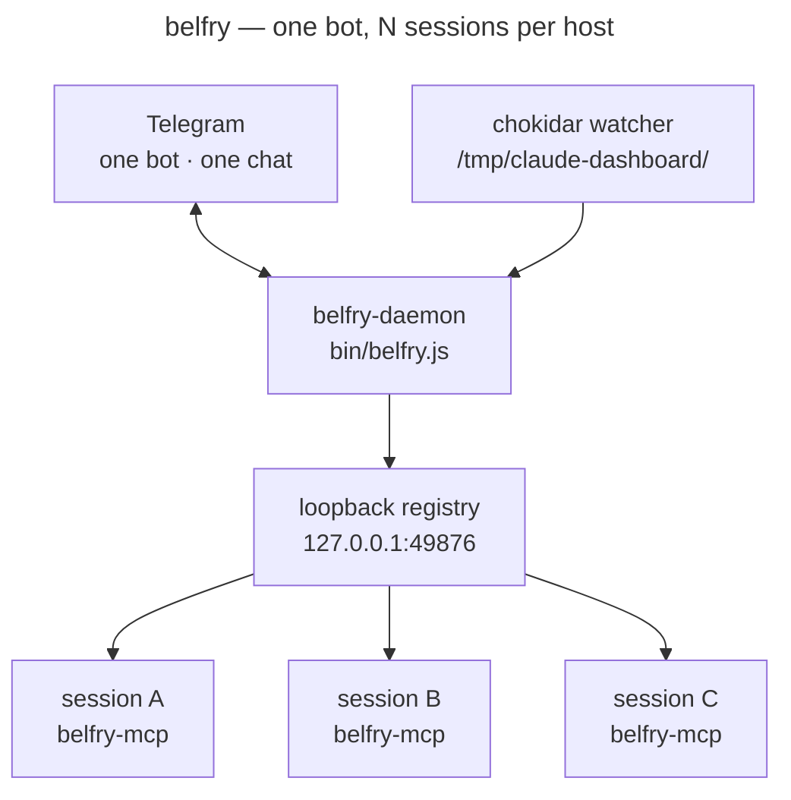
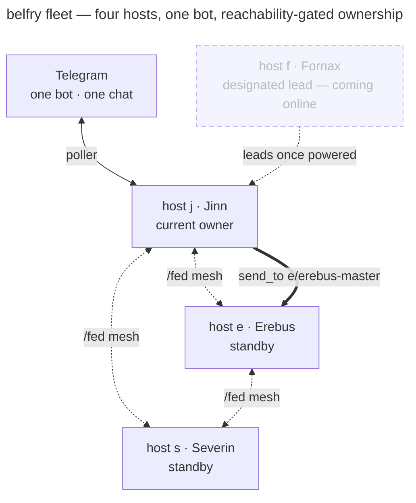

# belfry

A self-healing, multi-machine fleet that bridges Claude Code terminals to one Telegram bot — status from N parallel sessions across N hosts fans out to one chat, and replies feed back into the matching session as if you'd typed them at the prompt.

[](https://github.com/harteWired)

belfry is the fan-out complement to Anthropic's official `claude --channels plugin:telegram`. The official plugin gives you bidirectional chat with *one* session; belfry covers the case it doesn't — many terminals, many machines, one feed, with priority failover so a dead poller never drops your replies.

**Live page:** [lab.mattharte.com/belfry](https://lab.mattharte.com/belfry/) — overview, the fleet, architecture, trust model, quick start.

## What It Does

- **Fleet, not a single relay.** Each host runs a daemon; the daemons form a decentralized agent mesh over Tailscale. One Telegram bot serves the whole fleet — j, e, s, however many boxes you run.
- **Priority failover with handback.** A ranked election picks the Telegram owner. If the owner stops *reaching* Telegram — process dead or egress dead — a standby takes over in ~30–90s and hands back when the primary recovers. No more single-poller-dies-and-nothing-takes-over outage.
- **Fans out, routes back.** Subscribe the projects you care about per slug; your phone pings when any of them flips to `ready` or `error`. Reply on Telegram and the text lands in that session as user input — the local terminal stays sovereign, no multiplexer, no keystroke injection.
- **Agent-to-agent messaging.** Sessions message each other — local or cross-host — via a `send_to` MCP tool with `<letter>/<slug>` addressing and a flood/loop guard. The fleet is a mesh, not a star.
- **Talk to any session from your phone.** Direct-address a session on a peer host (`/keeper` → `e/erebus-master`); the reply threads back to your chat. Broadcast one message to every session with `/all`. Toggle subscriptions live with `/watch`.
- **A conversational brain, optional.** Free-form messages route through a Haiku subprocess on your Claude.ai subscription — no API key. Without it, deterministic routes still work.

## Quick Start

1. Create a Telegram bot via [@BotFather](https://t.me/BotFather) (`/newbot`). Save the token.
2. Get your chat ID: message the bot, then `curl https://api.telegram.org/bot<TOKEN>/getUpdates` and copy `message.chat.id`.
3. Copy `docs/belfry.jsonc.example` to `~/.claude/belfry.jsonc` and edit the subscription whitelist.
4. Run with the credentials in env:
   ```bash
   BELFRY_TOKEN=<token> BELFRY_CHAT_ID=<chat-id> node bin/belfry.js
   ```
5. For inbound replies, add the belfry MCP plugin to each project — see [`docs/install-mcp.md`](docs/install-mcp.md). For status JSONs without claudelike-bar, run `belfry-install-hook` from each project root.

For an always-on setup, write a launcher that pulls credentials from your secret store and `exec`s `node bin/belfry.js`. belfry only reads env vars — it's agnostic about where they come from.

## How It Works

Two processes. The **daemon** (`bin/belfry.js`) owns the bot, polls Telegram, and runs the chokidar watcher → composer chain for outbound pings. Each session you want bidirectional runs a tiny **`belfry-mcp`** stdio plugin that registers with the daemon over loopback HTTP and long-polls for replies. When a reply arrives, the plugin emits MCP `notifications/claude/channel` to inject the text into its parent claude — the same mechanism `plugin:telegram` uses for one-session bidirectional, generalized to N sessions sharing one bot.



Inbound routing is deterministic first: quote-reply (primary), then `/<slug> body` or `/<nickname> body`. Anything else falls to the brain. Replies from any chat ID other than `BELFRY_CHAT_ID` are dropped silently. The daemon reacts to each inbound with a routing-status emoji — 👀 delivered, 🤷 slug known but no live session, 🤔 unroutable — and swaps 👀 → 🫡 once the session answers.

## The Fleet

Set `BELFRY_HOST_LETTER` and a shared `BELFRY_FED_TOKEN` and the daemon joins a cross-host mesh. Each host runs its own daemon; peers connect over a token-gated `/fed/*` listener (default port `49878`, separate from the loopback registry). Nothing is host-specific in the code — peers are operator config. The reference fleet runs four boxes, each with its own job and any of them able to own the bot: **j** (Jinn, the primary workstation), **e** (Erebus, a Windows NUC), **s** (Severin, a NAS), and **f** (Fornax, a Raspberry Pi coming online).



**Failover (#38).** `BELFRY_HOST_PRIORITY` ranks the Telegram owners — lower is higher priority, `1` is primary. The highest-priority host that can actually reach Telegram owns the bot. Standbys run their pollers but stand by; the gate keys on a gossiped `reachableAt`, not mere mesh-liveness, so it fires whether the owner's process died or just its egress did. A ranked standby is a normal Telegram host with its own token and chat ID — distinct from `BELFRY_FED_ONLY`, which is for sessionless mesh nodes that must never contend for the bot.

**Agent mesh (#36).** A session calls `send_to(slug, text)`; cross-host targets use `<letter>/<slug>` addressing. The sender's slug is resolved from its registration, never trusted from the body — a session can't spoof another's identity. A per-source token bucket plus echo-dedup (`lib/agent-relay-guard.js`) stops floods and loops. Any CLI speaking the same spoke protocol can register a slug and join — the multi-model path.

**Federated DM (#44).** Direct-address a session on a peer host from Telegram — `/keeper` resolves to `e/erebus-master` and the daemon relays it across the mesh. The reply threads back into your chat via the bridge identity, so it reads like any other belfry reply.

Deeper detail: [`docs/plan-38-fleet-telegram.md`](docs/plan-38-fleet-telegram.md) and [`docs/federation.example.jsonc`](docs/federation.example.jsonc).

## Commands

The leading slash is optional on every command except `/all` and `/watch` — `status` works the same as `/status`. Phone keyboards make the slash a tap-and-hold detour, so belfry accepts both.

| Command | What it does |
|---|---|
| `status` | List every active session, one line each |
| `status <slug>` | Recent activity for one session, Haiku-summarized via the brain |
| `nick <name> <slug>` / `unnick <name>` / `nicks` | Manage slug aliases (`[a-z0-9][a-z0-9-]{0,31}`) |
| `/watch` | Open an inline-keyboard menu to toggle subscriptions live — no restart |
| `/watch <slug>` / `/unwatch <slug>` / `/watching` | Subscribe, unsubscribe, or list watched slugs |
| `/all <message>` | Broadcast to every registered session; daemon threads replies and posts a roll-up |
| `<slug-or-nick> <body>` | Direct-message a session, local or cross-host (`/keeper`, `e/erebus-master`) |
| `help [topic]` | Reference text. Topics: `routing`, `nicknames`, `status`, `agent` |
| `resume [<slug>] [<uuid>]` | List recent Claude Code sessions, or get a `claude --resume` command |

`/all` is also a local CLI: `belfry-broadcast "<message>"` with `--only a,b` / `--except c` filters. A session opts out with `BELFRY_BROADCAST=false`. Sessions message each other with the `send_to` MCP tool — the agent-mesh equivalent of a DM. Slugs always win over nicknames on collision.

## Configuration

Subscriptions live in `~/.claude/belfry.jsonc` (copy from `docs/belfry.jsonc.example`). Watch toggles from `/watch` persist to an overrides file layered over the hand-edited config, so live changes survive a restart without rewriting your jsonc.

belfry reads and writes the shared `/tmp/claude-dashboard/<slug>.json` convention (co-owned with [claudelike-bar](https://github.com/harteWired/claudelike-bar), not owned by belfry — see [`docs/CONVENTION.md`](docs/CONVENTION.md)). Under **Status-File Contract v1** (#40) the hook ancestor-walks the slug index, STRICT-skips on no match so unregistered subdirs mint no junk files, and read-merge-writes to preserve foreign fields like `context_percent`.

### Core env vars

| Variable | Required | Description |
|---|---|---|
| `BELFRY_TOKEN` | yes | Bot token from @BotFather |
| `BELFRY_CHAT_ID` | yes | Numeric chat ID where messages land |
| `BELFRY_FORUM_TOPIC_ID` | no | Default forum-topic ID; per-slug `topic` in belfry.jsonc wins |
| `BELFRY_MCP_PORT` | no | Loopback registry port (default `49876`) |
| `BELFRY_SEND_INTERVAL_MS` | no | Base gap between outbound writes (default `1100`). See pacing below |
| `BELFRY_REACT` | no | Routing-status emoji reactions, on by default |
| `BELFRY_BROADCAST` | no | Per-session opt-out for `/all` (set falsy to decline) |
| `BELFRY_TRANSCRIBE_KEY` | no | Whisper key for inbound voice notes (opt-in egress) |
| `BELFRY_STATE_DIR` | no | State dir (default `$XDG_STATE_HOME/belfry`) |

**Send-queue pacing (#35).** Every outbound write — replies, pings, reactions, broadcast roll-ups — funnels through one serial pacer, so an `/all` fan-out can't flood the chat into a 429. On a 429 the queue waits the server's `retry_after` and retries the same message (nothing dropped), then raises an adaptive floor for a cooldown window. `BELFRY_SEND_INTERVAL_MS` sets the base gap.

### Federation env vars

Federation is off until `BELFRY_HOST_LETTER` *and* `BELFRY_FED_TOKEN` are both set — a configured letter without the token is refused, fail-closed.

| Variable | Description |
|---|---|
| `BELFRY_HOST_LETTER` | This host's single-`[a-z0-9]` prefix for `<letter>/<slug>` addressing |
| `BELFRY_FED_TOKEN` | Shared bearer presented on `/fed/*`. Secret — env only, never the jsonc |
| `BELFRY_HOST_PRIORITY` | Ranked Telegram-owner priority; lower = higher (`1` = primary) |
| `BELFRY_FED_PEERS` | Compact peer list: `e,Erebus,http://erebus:49878;s,Severin,http://...` |
| `BELFRY_FED_PORT` / `BELFRY_FED_BIND` | `/fed/*` listener port (default `49878`) and bind address |
| `BELFRY_FED_ONLY` | Sessionless mesh mode — registry + `/fed` only, no Telegram poller |
| `BELFRY_BRIDGES` | Webhook bridge map for headless HTTP agents: `slug=url;…` |

The full env-var reference — every override, every default — lives in [`CLAUDE.md`](CLAUDE.md).

## Roadmap

**`/spawn <slug>` + `/kill <slug>` (#31).** Open and close a Claude Code terminal from Telegram — start a session on a host that has none, or stop a runaway one, all from your phone. The contract is design-locked (a neutral Launch-Request Contract so the spawn mechanism stays host-agnostic), but it is **not yet built**. Don't expect it in 0.3.0.

## Trust Model

Read this before pasting your bot token anywhere. The design is small and the threat model is short, but the consequences are sharp.

**Your bot token + chat ID together are a shell credential.** When inbound is enabled, any message from `BELFRY_CHAT_ID` is injected into the matching session as user input — including "run this shell command." Treat `BELFRY_TOKEN` like an SSH private key, not a webhook URL.

1. **Keep the token off disk and out of screenshots.** belfry never reads tokens from disk inside the project — env vars only. If you suspect a leak, `/revoke` it via @BotFather and restart.
2. **One chat, one user.** Messages from any chat ID other than `BELFRY_CHAT_ID` are dropped silently. Don't expand the allowlist without thinking through who that gives shell-equivalent access to.
3. **The loopback registry is token-gated.** The daemon binds `127.0.0.1:49876` and gates every route on a 32-byte bearer at `~/.local/state/belfry/registry.token` (mode 0600). Don't rebind it to `0.0.0.0`.
4. **The federation mesh is fail-closed.** The `/fed/*` listener refuses to start without `BELFRY_FED_TOKEN`, and every peer presents that bearer regardless of bind address. Run it over a private Tailscale interface — the mesh assumes a trusted network, and a peer that registers a slug joins your agent mesh.
5. **Workspace trust travels with the message.** A cross-host `send_to` or federated DM injects text into a remote session the same way a local reply does. Only federate hosts you'd hand a shell to — the trust boundary is the fleet, not one box.
6. **`/tmp/claude-dashboard/` should be 0700 with files 0600.** The daemon warns at startup if it finds a wider mode.
7. **The brain and voice transcription are opt-in egress.** The brain ships prompt+response pairs to Claude.ai (same data path your interactive sessions use). Voice notes leave the host only when `BELFRY_TRANSCRIBE_KEY` is set. Without either, nothing leaves the box past Telegram's own delivery.

The source is open (MIT) and tied to a real name. The codebase is a handful of small files with one runtime dependency (`chokidar`), so the trust model is auditable in a sitting.

## What's Shipped

| Phase | Scope | Status |
|---|---|---|
| 0 | Outbound: chokidar watcher → composer → Telegram | shipped |
| 2 | Inbound: per-session MCP plugin + loopback registry | shipped |
| #30 | Broadcast (`/all` + `belfry-broadcast`) | shipped |
| #32 | Routing-status emoji reactions | shipped |
| #35 | Serial send-queue / 429 pacing | shipped |
| #40 | Status-File Contract v1 + live `/watch` control panel | shipped |
| #29 | Cross-host federation (token-gated `/fed/*` mesh) | shipped |
| #36 | Agent-to-agent `send_to` messaging | shipped |
| #38 | Priority failover + handback | shipped |
| #44 | Federated Telegram DM to a peer-host session | shipped |
| #31 | `/spawn` + `/kill` from Telegram | design-locked, not built |

## Running Tests

```bash
npm test
```

Pure ESM, Node ≥ 20. Only runtime dependency is `chokidar`. Telegram client is native `fetch`; the MCP plugin is hand-rolled JSON-RPC over stdio; the registry and `/fed/*` listeners are hand-rolled HTTP over `node:http`. No SDK.

## Documentation

| Doc | What's in it |
|:---|:---|
| [`docs/CONVENTION.md`](docs/CONVENTION.md) | The `/tmp/claude-dashboard/<slug>.json` contract — shape, writers, coordination |
| [`docs/install-mcp.md`](docs/install-mcp.md) | Wiring `belfry-mcp` into a project's `.mcp.json` |
| [`docs/belfry.jsonc.example`](docs/belfry.jsonc.example) | Annotated subscription whitelist |
| [`docs/plan-38-fleet-telegram.md`](docs/plan-38-fleet-telegram.md) | Fleet design — federation, failover, handback |
| [`docs/federation.example.jsonc`](docs/federation.example.jsonc) | Annotated federation config |
| [`CLAUDE.md`](CLAUDE.md) | Full architecture, design constraints, and exhaustive env-var reference |

## License

MIT — see [`LICENSE`](LICENSE).
